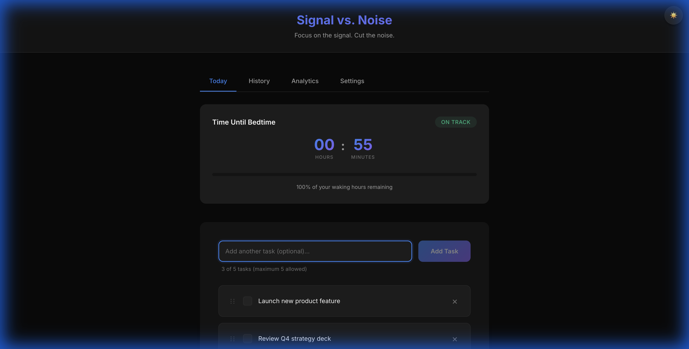

# 🎯 Signal vs. Noise

<div align="center">

**Stop drowning in endless to-do lists. Focus on what truly matters.**

[](https://sharathbyregowda.github.io/signal-focus)
[](LICENSE)
[](https://www.typescriptlang.org/)
[](https://reactjs.org/)

[Try It Now](https://sharathbyregowda.github.io/signal-focus) • [Documentation](docs/) • [Report Bug](https://github.com/sharathbyregowda/signal-focus/issues)

</div>

---

## 📸 Screenshot



---

## 💡 The Problem

You have 47 tasks on your to-do list. You're overwhelmed. You don't know where to start. By the end of the day, you've checked off 3 random items and feel unproductive.

**Sound familiar?**

---

## ✨ The Solution

**Signal vs. Noise** forces you to ask one question every morning:

> **"What are the 3-5 things that, if completed today, would make this day a success?"**

Everything else is noise.

### The Rules

1. **3-5 Tasks Daily** - No more, no less. Constraints breed focus.
2. **Countdown Timer** - Your waking hours are finite. Use them wisely.
3. **Morning Briefing** - Plan ahead. Review incomplete tasks each morning.
4. **Privacy First** - Your data stays on your device. No accounts, no tracking.

---

## 🚀 Features

### 🎯 Core Productivity

- **Daily Task Focus** - Add 3-5 mission-critical tasks. That's it.
- **Countdown Timer** - Tracks your waking hours. Customizable to your schedule.
- **Focus Mode** - Distraction-free, one-task-at-a-time view.
- **Morning Briefing** - Plan tasks the night before. Review them in the morning.

### 📊 Insights & Analytics

- **Streak Tracking** - See how many consecutive days you've stayed focused.
- **Completion Rate** - Measure your productivity over time.
- **History View** - Review past sessions and learn from patterns.
- **Session Notes** - Journal your thoughts and reflections.

### 🎨 User Experience

- **Dark/Light Mode** - Easy on the eyes, day or night.
- **Mobile Optimized** - Works seamlessly on phones and tablets.
- **Offline First** - No internet? No problem. Everything works locally.
- **Export/Import** - Move your data between devices effortlessly.

---

## 🎬 Try It Now

**👉 [Launch App](https://sharathbyregowda.github.io/signal-focus)**

No signup. No installation. Just open and start focusing.

---

## 🏃 Quick Start (For Developers)

```bash
# Clone the repo
git clone https://github.com/sharathbyregowda/signal-focus.git
cd signal-focus

# Install dependencies
npm install

# Start dev server
npm run dev

# Open http://localhost:5173
```

---

## 🧠 Philosophy

Inspired by the **Pareto Principle** (80/20 rule) and **Deep Work** by Cal Newport.

### The Signal

- Tasks that move you toward your goals
- High-impact, high-value work
- What you'll remember at the end of the year

### The Noise

- Busywork that feels productive but isn't
- Low-impact tasks that fill time
- What you'll forget by next week

**This app helps you amplify the signal and cut the noise.**

---

## 🛠️ Tech Stack

- **React 18** + **TypeScript** - Type-safe, modern UI
- **Vite** - Lightning-fast build tool
- **CSS Variables** - Dynamic theming (dark/light mode)
- **LocalStorage** - Privacy-first data persistence
- **Vitest** - Fast, reliable testing

---

## 📖 How It Works

### 1️⃣ **Set Your Schedule**
Configure your wake and sleep times in Settings. The app calculates your waking hours.

### 2️⃣ **Add Your Tasks**
Every morning (or the night before), add 3-5 mission-critical tasks.

### 3️⃣ **Work With Intent**
The countdown timer keeps you aware of your finite time. Focus Mode eliminates distractions.

### 4️⃣ **Review & Reflect**
At the end of the day, add session notes. Track your streaks and completion rate over time.

### 5️⃣ **Morning Briefing**
If you have incomplete tasks from yesterday, the app asks: **"Is this still Signal?"**

---

## 🌟 What Makes This Different?

| Feature | Signal vs. Noise | Traditional To-Do Apps |
|---------|------------------|------------------------|
| **Task Limit** | 3-5 tasks max | Unlimited (overwhelming) |
| **Daily Reset** | Fresh start every day | Tasks pile up forever |
| **Time Awareness** | Countdown timer | No time tracking |
| **Privacy** | 100% local, no accounts | Cloud sync, accounts required |
| **Focus** | Intentional constraints | Feature bloat |

---

## 📱 Mobile Experience

Fully responsive. Add to your home screen for an app-like experience.

---

## 🔒 Privacy & Data

- **No accounts** - Start using immediately
- **No tracking** - Zero analytics, zero cookies
- **Local storage** - Your data never leaves your device
- **Export/Import** - Full control over your data

---

## 🤝 Contributing

Contributions are welcome! Here's how:

1. Fork the repo
2. Create a feature branch (`git checkout -b feature/amazing-feature`)
3. Commit your changes (`git commit -m 'Add amazing feature'`)
4. Push to the branch (`git push origin feature/amazing-feature`)
5. Open a Pull Request

---

## 📄 License

MIT License - feel free to use this for personal or commercial projects.

---

## 🙏 Inspiration

This app is inspired by productivity philosophies from:

- **Cal Newport** - *Deep Work*
- **Brian Tracy** - *Eat That Frog*
- **Gary Keller** - *The One Thing*
- **David Allen** - *Getting Things Done*

---

## 💬 Feedback

Love it? Have ideas? Found a bug?

- ⭐ **Star this repo** if you find it useful
- 🐛 **Report bugs** via [GitHub Issues](https://github.com/sharathbyregowda/signal-focus/issues)
- 💡 **Request features** - we're always improving

---

<div align="center">

**Made with ❤️ for focused, intentional productivity**

[Try It Now](https://sharathbyregowda.github.io/signal-focus) • [Documentation](docs/) • [GitHub](https://github.com/sharathbyregowda/signal-focus)

</div>
